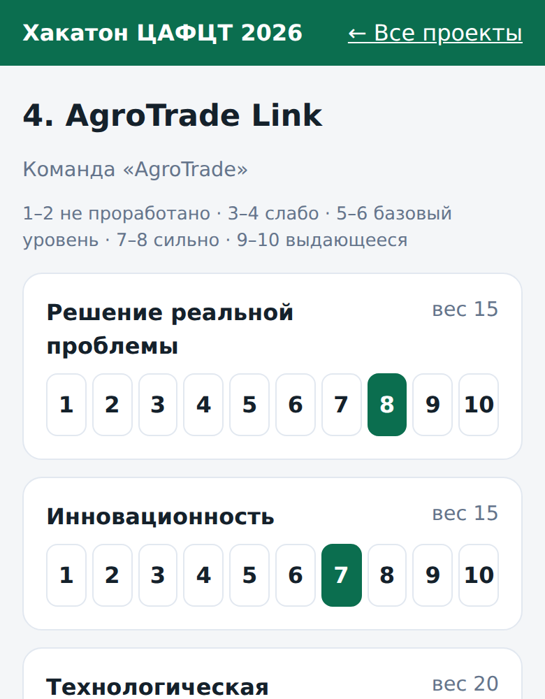
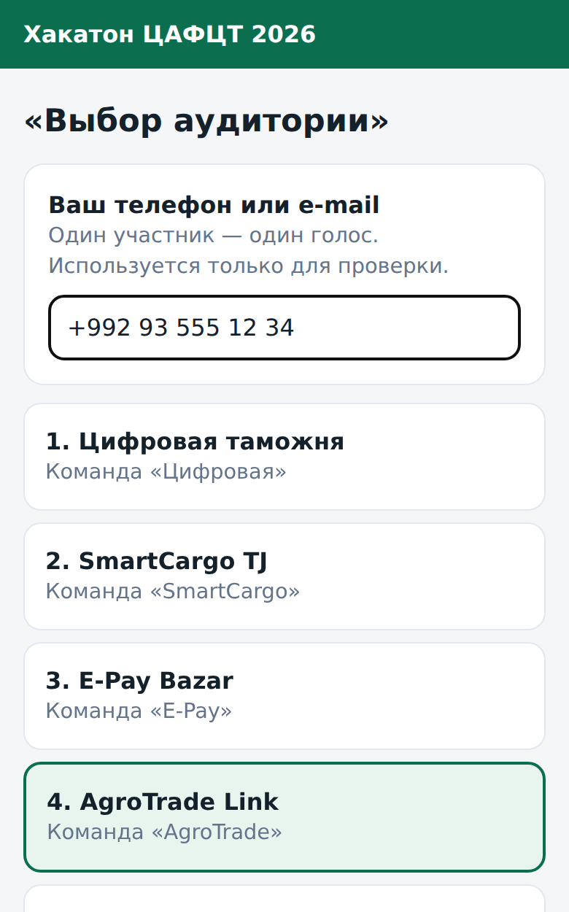
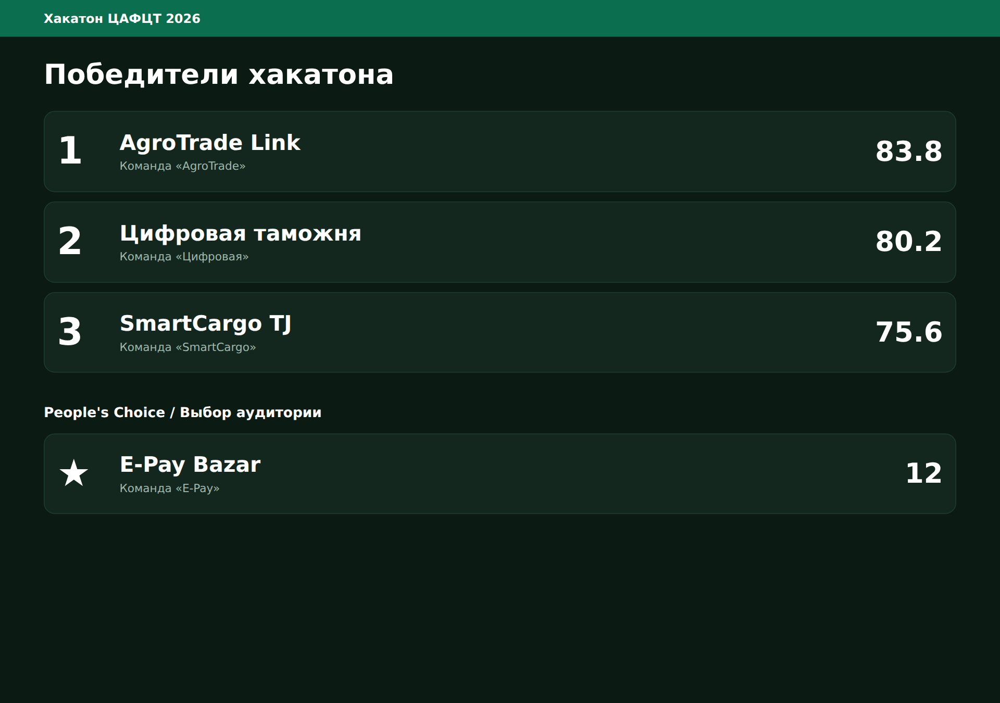
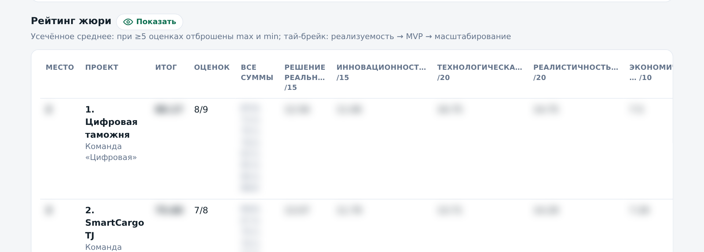

<div align="center">

# 🗳️ Hackathon Jury Vote

**Система онлайн-голосования жюри и зрителей для финала хакатона**

Жюри оценивает команды со своего телефона по персональному QR-коду,
зрители голосуют за «Выбор аудитории», а секретариат управляет всем с одного пульта
и выводит итоги на проектор.


</div>

---

## ✨ Возможности

| | |
|---|---|
| 📱 **Персональные QR для жюри** | У каждого члена жюри своя ссылка-токен — без логинов и паролей. Карточки для печати генерируются автоматически. |
| ⚖️ **Взвешенные критерии** | 7 критериев с весами (сумма — 100 баллов), оценка по шкале 1–10. |
| ✂️ **Усечённое среднее** | При 5+ оценках самая высокая и самая низкая отбрасываются — один «выброс» не решает судьбу проекта. |
| 🚫 **Конфликт интересов** | Отмеченный член жюри физически не может оценить проект, и его голос не учитывается. |
| 🥇 **Тай-брейк** | При равенстве баллов — сравнение по «реалистичности внедрения» → «MVP» → «масштабированию». Настоящая ничья подсвечивается на пульте. |
| 👥 **Выбор аудитории** | Отдельное голосование зрителей: 1 телефон / e-mail = 1 голос + защита по cookie. |
| ⚡ **Живое обновление** | Без перезагрузки страницы: «Сейчас выступает» подсвечивается у жюри, открытие/закрытие голосования применяется мгновенно, индикатор потери связи. |
| 🙈 **Скрытые оценки** | Рейтинг на пульте размыт по умолчанию («глазик»), строки сортируются по номеру, чтобы не выдать лидера раньше времени. |
| 📺 **Экран для проектора** | QR для зрителей → по кнопке «Показать итоги» — ТОП-3 и People's Choice. |
| 📊 **Экспорт в CSV** | Итоговый рейтинг, все оценки жюри с комментариями и голоса аудитории — одним файлом для протокола. |

## 📸 Скриншоты

<table>
  <tr>
    <td align="center" width="33%"><br><sub>Оценочный лист жюри</sub></td>
    <td align="center" width="33%"><br><sub>«Выбор аудитории»</sub></td>
    <td align="center" width="33%"><br><sub>Итоги на проекторе</sub></td>
  </tr>
  <tr>
    <td colspan="3" align="center"><br><sub>Пульт секретариата: рейтинг скрыт до нажатия на «глазик»</sub></td>
  </tr>
</table>

## 🚀 Быстрый старт

```bash
git clone https://github.com/GostWarrir186/hackathon-jury-vote.git
cd hackathon-jury-vote
cp .env.example .env        # укажите BASE_URL и надёжный ADMIN_PASSWORD
docker compose up -d --build
```

Приложение будет доступно на `http://localhost:8010`, пульт — на `/admin`.

<details>
<summary>Запуск без Docker</summary>

```bash
python3 -m venv .venv && source .venv/bin/activate
pip install -r requirements.txt
export DB_PATH=./data/jury.db BASE_URL=http://localhost:8000 ADMIN_PASSWORD=secret
uvicorn app.main:app --reload
```
</details>

## ⚙️ Конфигурация

| Переменная | По умолчанию | Описание |
|---|---|---|
| `BASE_URL` | `http://localhost:8000` | Публичный адрес. Именно он зашивается в QR-коды. Может содержать префикс пути (`https://example.com/jury`). |
| `ADMIN_USER` | `admin` | Логин пульта (HTTP Basic Auth). |
| `ADMIN_PASSWORD` | `change-me` | Пароль пульта. **Обязательно поменяйте.** |
| `EVENT_TITLE` | `Hackathon 2026` | Название мероприятия в шапке. |
| `DB_PATH` | `/data/jury.db` | Путь к базе SQLite. |

## 🗺️ Адреса

| Адрес | Кто | Назначение |
|---|---|---|
| `/admin` | Секретариат | Пульт: открыть/закрыть голосование, «Выступает сейчас», прогресс, рейтинг, CSV |
| `/admin/setup` | Секретариат | Финалисты, жюри, конфликты интересов, сброс после репетиции |
| `/admin/qr` | Секретариат | Печать QR-карточек жюри и большого QR для зрителей |
| `/j/<token>` | Член жюри | Персональный оценочный лист |
| `/vote` | Зрители | «Выбор аудитории» |
| `/screen` | Проектор | QR для зрителей → итоги |

## 📚 Документация

- [Руководство организатора](docs/user-guide.md) — сценарий проведения финала шаг за шагом
- [Развёртывание](docs/deployment.md) — Docker, nginx, обновление, бэкапы, типичные проблемы
- [Архитектура и подсчёт](docs/architecture.md) — устройство приложения, схема БД, алгоритм рейтинга, API
- [Журнал изменений](CHANGELOG.md)

## 🧱 Стек

**Backend:** FastAPI · SQLite · Jinja2 · qrcode
**Frontend:** серверный рендеринг, чистый HTML/CSS/JS без сборки, mobile-first
**Инфраструктура:** Docker Compose · nginx reverse proxy

```
app/
├── main.py          # всё приложение: БД, подсчёт, маршруты
└── templates/       # Jinja2-шаблоны страниц
deploy/nginx/        # пример блока nginx для работы под префиксом
docs/                # документация и скриншоты
```

## 📄 Лицензия

[MIT](LICENSE)
