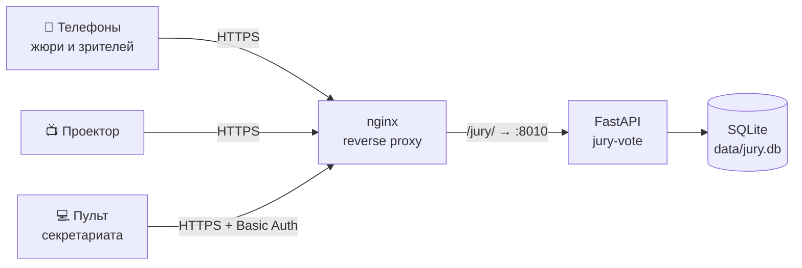

# Архитектура и подсчёт

## Схема

Приложение намеренно простое: один файл `app/main.py`, серверный рендеринг Jinja2, никакой сборки фронтенда.
Живые обновления реализованы коротким опросом `/api/state` раз в 2 секунды — этого достаточно для десятков
одновременных пользователей и не требует WebSocket-инфраструктуры.

## Схема базы данных

```mermaid
erDiagram
    jurors ||--o{ scores : ставит
    projects ||--o{ scores : получает
    jurors ||--o{ conflicts : имеет
    projects ||--o{ conflicts : имеет
    projects ||--o{ audience_votes : получает

    jurors {
        int id PK
        text name
        text role
        text token UK
        int active
        int onboarded
    }
    projects {
        int id PK
        int num
        text name
        text team
        int active
    }
    scores {
        int juror_id PK
        int project_id PK
        int c1_to_c7
        text comment
        text updated_at
    }
    conflicts {
        int juror_id PK
        int project_id PK
    }
    audience_votes {
        text voter PK
        int project_id
        text created_at
    }
    settings {
        text key PK
        text value
    }
```

`settings` хранит состояние мероприятия: `jury_open`, `audience_open`, `results_public`, `current_project`.
Удаление жюри и проектов «мягкое» (`active = 0`), чтобы не терять историю оценок.

## Критерии

| # | Критерий | Вес |
|---|---|---|
| c1 | Решение реальной проблемы | 15 |
| c2 | Инновационность | 15 |
| c3 | Технологическая реализация / MVP | 20 |
| c4 | Реалистичность внедрения | 20 |
| c5 | Экономический / социальный эффект | 10 |
| c6 | Потенциал масштабирования | 10 |
| c7 | Pitch + ответы на вопросы | 10 |

Критерии и веса задаются списком `CRITERIA` в `app/main.py`.

## Алгоритм рейтинга

1. **Балл члена жюри** за проект: `Σ (оценка_i × вес_i / 10)` → от 10 до 100.
2. **Фильтрация**: не учитываются оценки неактивных членов жюри и оценки при конфликте интересов.
3. **Итог проекта**: среднее по жюри. Если оценок `≥ 5` (`TRIM_MIN_VOTES`), отбрасываются одна максимальная и одна минимальная.
4. **Сортировка**: по итогу, затем тай-брейк по средним баллам критериев
   **c4** (реалистичность) → **c3** (MVP) → **c6** (масштабирование).
5. **Ничья**: если совпадают итог и все три тай-брейка — обе строки помечаются флагом `tie`.

Голоса аудитории считаются отдельно и не смешиваются с оценкой жюри.

## Голосование зрителей

- Идентификатор голосующего нормализуется: e-mail приводится к нижнему регистру, из телефона остаются только цифры
  (9-значный местный номер дополняется кодом страны).
- Ограничения: один идентификатор — один голос (первичный ключ), плюс cookie `voted` на устройстве на 7 дней.

## HTTP-маршруты

| Метод | Путь | Доступ | Описание |
|---|---|---|---|
| GET | `/` | все | Стартовая страница |
| GET | `/j/{token}` | жюри | Список проектов члена жюри |
| GET | `/j/{token}/intro` | жюри | Памятка при первом входе |
| POST | `/j/{token}/start` | жюри | Отметка «прочитал» и переход к текущей команде |
| GET/POST | `/j/{token}/p/{pid}` | жюри | Оценочный лист / сохранение оценки |
| GET | `/api/state` | все | JSON-состояние для живых обновлений |
| GET/POST | `/vote` | все | Голосование зрителей |
| GET | `/screen` | все | Экран для проектора |
| GET | `/qr/audience.svg` | все | QR на страницу голосования |
| GET | `/admin` | админ | Пульт |
| POST | `/admin/settings` | админ | Открыть/закрыть голосования, текущая команда, показ итогов |
| GET | `/admin/setup` | админ | Настройка |
| POST | `/admin/projects`, `/admin/jurors`, `/admin/conflicts` | админ | Сохранение настроек |
| POST | `/admin/reset` | админ | Сброс оценок / голосов / всего |
| GET | `/admin/qr` | админ | Печать QR-карточек |
| GET | `/qr.svg?data=` | админ | Произвольный QR |
| GET | `/admin/export.csv` | админ | Экспорт результатов |
